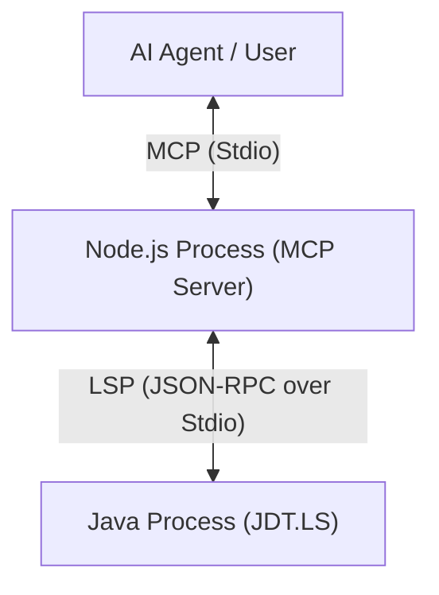
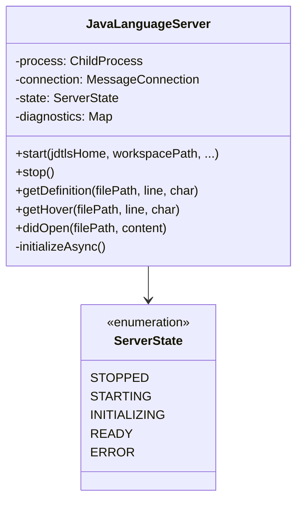
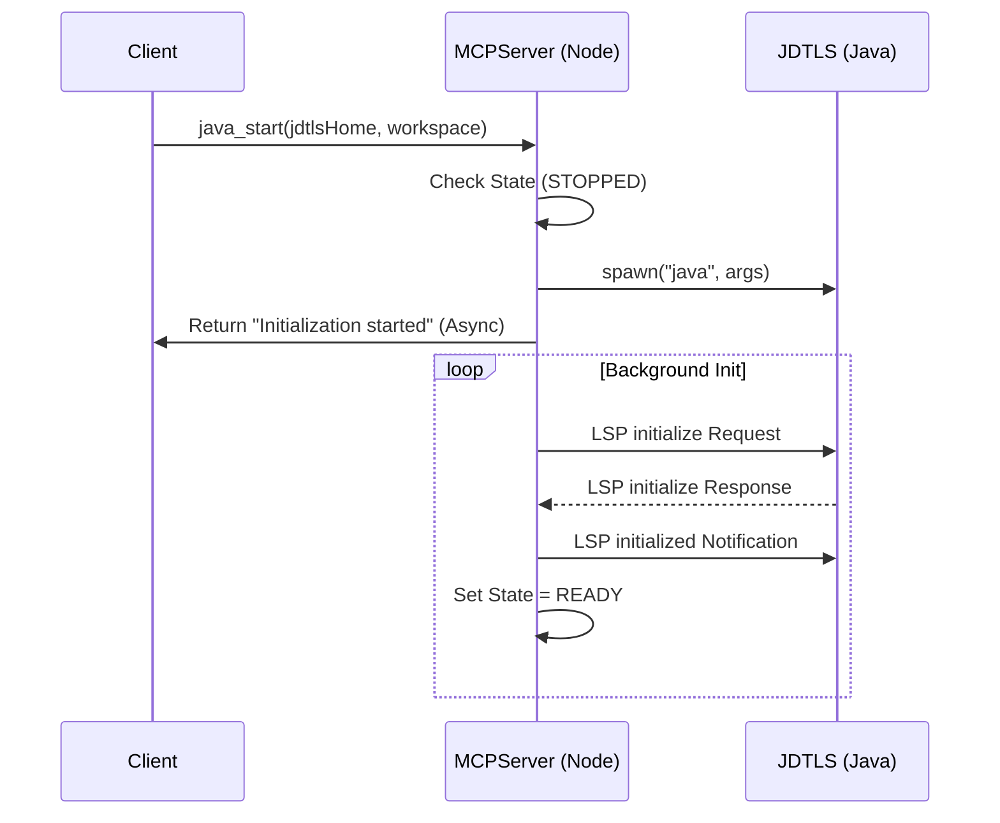
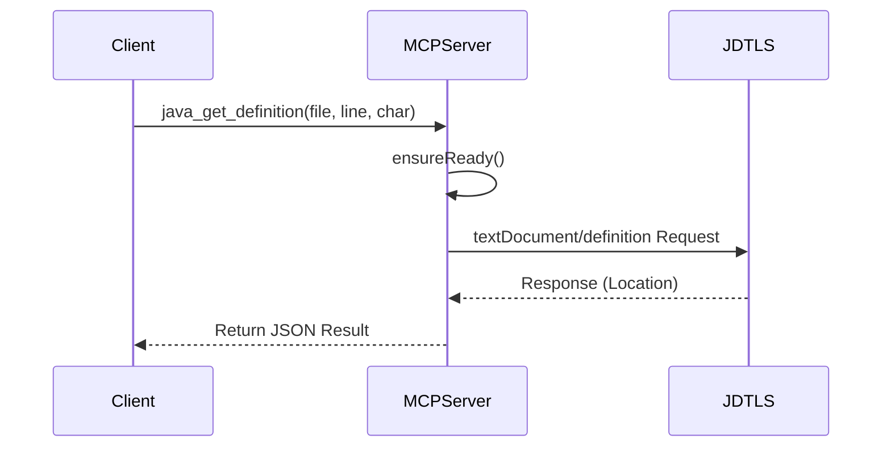
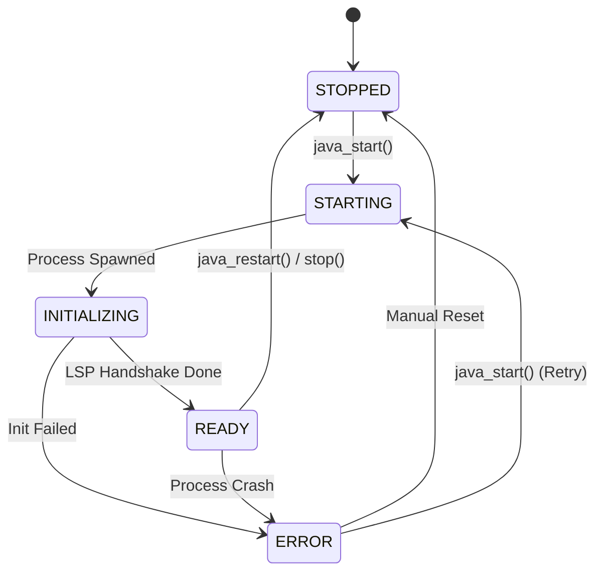

# Java MCP Server 详细设计说明书

----------

| **Document Form** |            |
| ----------------- | ---------- |
| **Subject**       | Java MCP Server 详细设计说明书 |
| **Version**       | 1.0.0      |
| **Content**       | Java MCP Server 核心模块详细设计 |
| **Key Words**     | MCP, Java, JDT.LS, LSP, Node.js |
| **Reference**     | 概要设计说明书, MCP SDK 文档 |
| **Date**          | 2026-01-29 |
| **Owner**         | 项目组        |
| **Update by**     | Gemini CLI |

----------

> 请按照下述表单如实填写修订记录。

| **修订记录** |            |                     |            |                             |
| -------- | ---------- | ------------------- | ---------- | --------------------------- |
| **修订版本** | **修订方式**   | **修订人员**            | **修订日期**   | **修订内容**                    |
| V1.0     | AI生成       | Gemini CLI          | 2026-01-29 | 初版详细设计文档，基于源代码分析生成          |

**目  录**

- [Java MCP Server 详细设计说明书](#java-mcp-server-详细设计说明书)
- [文档撰写及关键评审点](#文档撰写及关键评审点)
- [1 引言](#1-引言)
  - [1.1 编写目的](#11-编写目的)
  - [1.2 背景](#12-背景)
    - [1.2.1 模块简述](#121-模块简述)
    - [1.2.2 参与人员](#122-参与人员)
  - [1.3 定义](#13-定义)
  - [1.4 参考资料](#14-参考资料)
- [2 系统结构设计](#2-系统结构设计)
  - [2.1 顶层系统结构](#21-顶层系统结构)
  - [2.2 MCP 服务层结构](#22-mcp-服务层结构)
  - [2.3 语言服务集成层结构](#23-语言服务集成层结构)
- [3 用户界面](#3-用户界面)
- [4 接口设计](#4-接口设计)
  - [4.1 外部接口](#41-外部接口)
    - [4.1.1 对外输出接口 (MCP Tools)](#411-对外输出接口-mcp-tools)
    - [4.1.2 对外依赖接口 (LSP)](#412-对外依赖接口-lsp)
  - [4.2 内部接口](#42-内部接口)
- [5 类模型](#5-类模型)
  - [5.1 系统类模型](#51-系统类模型)
  - [5.2 类描述](#52-类描述)
    - [5.2.1 JavaLanguageServer](#521-javalanguageserver)
      - [5.2.1.1 属性](#5211-属性)
      - [5.2.1.2 方法](#5212-方法)
- [6 动态模型](#6-动态模型)
  - [6.1 场景（Scenarios）](#61-场景scenarios)
    - [6.1.1 场景1：服务启动与初始化](#611-场景1服务启动与初始化)
    - [6.1.2 场景2：定义跳转查询](#612-场景2定义跳转查询)
  - [6.2 状态图](#62-状态图)
    - [6.2.1 JDT.LS 生命周期状态图](#621-jdtls-生命周期状态图)
- [7 非功能性需求](#7-非功能性需求)
- [8 需要单元测试或代码审查清单](#8-需要单元测试或代码审查清单)

----------

# 文档撰写及关键评审点

> 请文档作者及评审官在撰写及评审文档时重点关注以下要点

| **对应详设文档章节** | **关键评审点**                         |
| ------------ | --------------------------------- |
| 0 全局         | **扩展性**: 代码结构是否支持未来添加新的 LSP 功能        |
| 3 系统结构设计     | **层次**: MCP 协议处理与底层 JDT.LS 进程管理是否解耦     |
| 5 类模型        | **健壮性**: 进程异常退出、通信中断等异常情况的处理机制      |
| 6 动态模型       | **异步**: 启动及耗时操作是否采用异步非阻塞模式           |
| 7 非功能性设计     | **环境隔离**: 是否处理了环境变量干扰及工作区数据隔离      |

----------

# 1 引言

## 1.1 编写目的

本详细设计说明书旨在明确 **Java MCP Server** 的内部实现细节，指导开发人员进行代码维护和功能扩展。文档详细描述了核心类 `JavaLanguageServer` 的属性与方法、MCP 工具与 LSP 协议的映射关系、以及系统的动态行为模式。

## 1.2 背景

### 1.2.1 模块简述

本模块是 Java MCP Server 的核心后端逻辑，负责：
1.  **MCP 协议适配**：将 AI Agent 的工具调用请求转换为内部操作。
2.  **JDT.LS 进程管理**：负责启动、停止、监控 Eclipse JDT.LS 子进程。
3.  **LSP 协议交互**：通过 JSON-RPC 与 JDT.LS 通信，提供代码分析能力。

### 1.2.2 参与人员

| **角  色** | **主要职责** | **负责模块** | **人员** | **备注** |
| :--- | :--- | :--- | :--- | :--- |
| 架构师 | 系统架构设计 | 整体架构 | - | - |
| 开发者 | 核心功能实现 | MCP Server, JDT.LS Integration | Gemini CLI | - |

## 1.3 定义

| 术语 | 定义 |
| :--- | :--- |
| MCP | Model Context Protocol，模型上下文协议。 |
| LSP | Language Server Protocol，语言服务器协议。 |
| JDT.LS | Eclipse Java Development Tools Language Server。 |
| JSON-RPC | 一种轻量级远程过程调用协议，用于 LSP 通信。 |

## 1.4 参考资料

| **编号** | **名称** | **作者** | **日期** | **密级** |
| :--- | :--- | :--- | :--- | :--- |
| 1 | Java MCP Server 概要设计说明书 | Gemini CLI | 2026-01-29 | 内部公开 |
| 2 | Language Server Protocol Specification | Microsoft | - | 公开 |
| 3 | Model Context Protocol SDK Reference | Anthropic | - | 公开 |

------------

# 2 系统结构设计

## 2.1 顶层系统结构

系统采用双进程架构，通过标准输入/输出流（Stdio）进行通信。

## 2.2 MCP 服务层结构

位于 `index.ts`，主要职责：
*   初始化 `McpServer` 实例。
*   注册 MCP Tools（如 `java_start`, `java_get_definition`）。
*   解析工具参数并调用 `JavaLanguageServer` 实例。
*   处理异常并将结果封装为 MCP 响应格式。

## 2.3 语言服务集成层结构

位于 `language-server.ts`，主要职责：
*   封装 `JavaLanguageServer` 类。
*   管理 Java 子进程的生命周期（Spawn, Kill）。
*   建立 JSON-RPC 连接（`vscode-jsonrpc`）。
*   维护服务状态机（STOPPED, STARTING, READY 等）。
*   管理工作区配置与临时数据目录。

------------

# 3 用户界面

本项目为无头（Headless）服务，无图形用户界面（GUI）。
用户交互完全通过 CLI 命令或 MCP 协议的工具调用（Tool Calls）进行。

日志输出：
*   `stderr`: 用于输出日志、调试信息和错误堆栈（不影响 MCP 协议通信）。
*   `stdout`: 严禁直接打印日志，仅用于 MCP 协议通信（JSON 消息）。

------------

# 4 接口设计

## 4.1 外部接口

### 4.1.1 对外输出接口 (MCP Tools)

系统向 AI Agent 暴露的 MCP 工具集。

| 接口名称 | 实现类名称 | 对应内部方法 | 描述 |
| :--- | :--- | :--- | :--- |
| `java_start` | `JavaLanguageServer` | `start()` | 启动或重启 JDT.LS，初始化工作区。 |
| `java_load_maven_project` | `JavaLanguageServer` | `addWorkspaceFolder()` | 加载 Maven 项目并建立索引。 |
| `java_get_definition` | `JavaLanguageServer` | `getDefinition()` | 获取符号定义位置。 |
| `java_get_hover` | `JavaLanguageServer` | `getHover()` | 获取符号的文档悬停信息。 |
| `java_get_diagnostics` | `JavaLanguageServer` | `getDiagnostics()` | 获取文件的编译错误/警告。 |
| ... | ... | ... | 参见概要设计及 `index.ts` 定义。 |

### 4.1.2 对外依赖接口 (LSP)

系统作为 LSP Client 调用的 JDT.LS 接口。

| 接口名称 | 协议方向 | 方法 | 描述 |
| :--- | :--- | :--- | :--- |
| `initialize` | Request | `start()` | 初始化 LSP 会话，协商能力。 |
| `textDocument/didOpen` | Notification | `didOpen()` | 通知文件打开，触发编译。 |
| `textDocument/definition` | Request | `getDefinition()` | 请求定义位置。 |
| `workspace/symbol` | Request | `searchSymbols()` | 全局符号搜索。 |
| `java/classFileContents` | Request | `getClassFileContents()` | 获取 `.class` 文件的反编译源码。 |

## 4.2 内部接口

`JavaLanguageServer` 类暴露给 `index.ts` 的公共方法。

| 接口名称 | 参数 | 返回值 | 描述 |
| :--- | :--- | :--- | :--- |
| `isRunning` | void | boolean | 检查服务是否处于运行状态。 |
| `getState` | void | ServerState | 获取当前生命周期状态。 |
| `ensureReady` | void | void | 检查服务就绪状态，未就绪则抛出异常。 |

-----------

# 5 类模型

## 5.1 系统类模型

系统核心围绕 `JavaLanguageServer` 单例展开。

## 5.2 类描述

### 5.2.1 JavaLanguageServer

#### 5.2.1.1 属性

| 属性名称 | 数据类型 | 约束 | 描述 |
| :--- | :--- | :--- | :--- |
| `process` | `ChildProcess \| null` | 私有 | JDT.LS 的 Java 子进程句柄。 |
| `connection` | `rpc.MessageConnection \| null` | 私有 | JSON-RPC 连接对象，用于发送 LSP 请求。 |
| `state` | `ServerState` | 私有 | 当前服务器状态（默认 STOPPED）。 |
| `diagnostics` | `Map<string, any[]>` | 私有 | 缓存接收到的文件诊断信息（Key为文件URI）。 |
| `currentWorkspace` | `string \| null` | 私有 | 当前激活的工作区根路径。 |

#### 5.2.1.2 方法

**1. `start`**

| 调用参数与类型 | `jdtlsHome: string`, `workspacePath: string`, `javaHome?: string`, ... |
| :--- | :--- |
| 返回参数与类型 | `Promise<void>` |
| 处理逻辑 | 1. 检查状态，若非 STOPPED 则返回。 2. 清理环境变量（移除 PORT 等干扰项）。 3. 计算 config 和 data 目录路径。 4. spawn 启动 Java 进程。 5. 建立 JSON-RPC 连接。 6. 触发 `initializeAsync` 进行 LSP 初始化。 |

**2. `initializeAsync` (Private)**

| 调用参数与类型 | `workspacePath: string`, ... |
| :--- | :--- |
| 返回参数与类型 | `Promise<void>` |
| 处理逻辑 | 1. 发送 LSP `initialize` 请求，配置 capabilities。 2. 等待响应，设置 `this.capabilities`。 3. 发送 `initialized` 通知。 4. 更新状态为 `READY`。 |

**3. `getDefinition`**

| 调用参数与类型 | `filePath: string`, `line: number`, `character: number` |
| :--- | :--- |
| 返回参数与类型 | `Promise<any>` |
| 处理逻辑 | 1. 调用 `ensureReady()` 检查状态。 2. 将路径转换为 URI。 3. 发送 `textDocument/definition` 请求并返回结果。 |

-----------

# 6 动态模型

## 6.1 场景（Scenarios）

### 6.1.1 场景1：服务启动与初始化

**描述**：用户首次调用 `java_start`，启动 JDT.LS 进程并完成初始化。

**顺序图**：

### 6.1.2 场景2：定义跳转查询

**描述**：用户查询某个类或方法的定义位置。

**顺序图**：

## 6.2 状态图

### 6.2.1 JDT.LS 生命周期状态图

核心状态流转逻辑。

-----------

# 7 非功能性需求

1.  **环境隔离**：
    *   **Data Isolation**: 使用工作区路径的 Hash 值生成独立的 data 目录（`jdtls-ProjectName-Hash`），确保不同项目的索引数据互不干扰。
    *   **Env Cleanup**: 启动 Java 进程前强制移除 `PORT`, `CLIENT_PORT` 等环境变量，防止 JDT.LS 误判为 Socket 模式。

2.  **健壮性**：
    *   **Async Initialization**: 启动过程异步化，避免阻塞 MCP 响应，防止因 JVM 启动慢导致 MCP 请求超时。
    *   **Process Monitoring**: 监听 Java 子进程的 `exit` 和 `error` 事件，自动更新服务状态，并允许通过 `java_restart` 恢复。

3.  **兼容性**：
    *   **Cross-Platform**: 适配 Windows/Linux/macOS 的路径格式（正反斜杠处理）。
    *   **Java Version**: 支持用户自定义 JDK 路径，自动检测 Java 版本。

-----------

# 8 需要单元测试或代码审查清单

| **类名 / 模块** | **单元测试** | **代码审查** | **备注** |
| :--- | :--- | :--- | :--- |
| `JavaLanguageServer.start` | N | Y | 涉及进程启动和复杂参数构建，需重点审查路径和环境变量处理。 |
| `JavaLanguageServer.getDataDir` | Y | Y | 验证 Hash 生成和路径拼接逻辑，确保跨平台兼容性。 |
| `JavaLanguageServer.state` | Y | Y | 验证状态机流转逻辑，特别是异常情况下的状态重置。 |
| `index.ts` Tool Handlers | N | Y | 审查输入参数校验及异常捕获逻辑。 |
